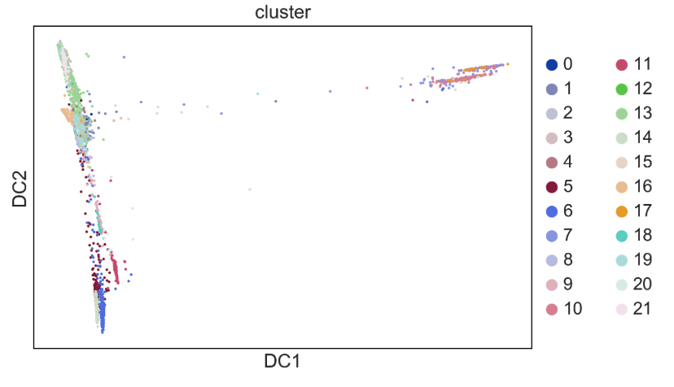
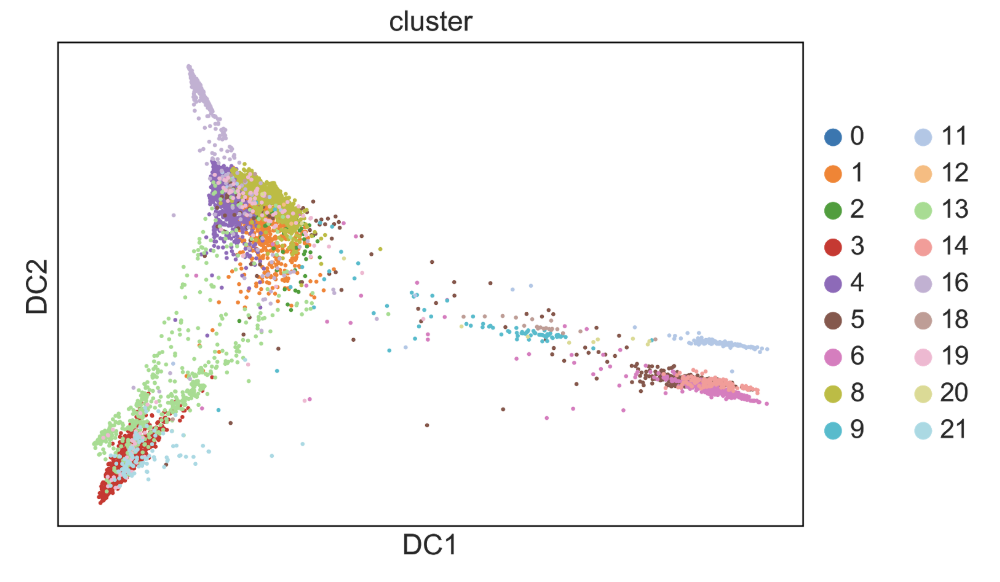

# Cell Ordering ("Pseudotime")
As you do clustering and differential expression you might notice that it is hard to split your cells into clusters. As you have probably heard, cells exist on a continuum of states and heterogeneity is not discrete. This is particularly relevant in the realm of differentiation, which is where the annoying name ‘pseudotime’ comes from. Pseudotime can also be used for cells responding to a stimulation over time, but most of the algorithms/packages were made with differentiation, not response, in mind so using pseudotime resources and interpreting results with these datasets can be more challenging. The idea here is that we can look at cell’s location in differentiation space by modeling gene expression space as a continuous state. This assumption means that we are observing cells at many points between the discrete states we consider ‘cell types’ and that these continuum can tell us about the process of differentiation. 
A very elaborate and in depth review describes this wayy better- https://doi.org/10.1101/276907.

Another way to improve pseudotime is using velocity - [this guide](not_found) describes one way to calculate RNA velocity.

Pseudotime methods can have the following outputs (not an exhaustive list):
* A pretty picture of cells in a continuous space (“look! My stem cells are earlier in pseudotime than my differentiated cells!”) on which you can visualize clusters or other metadata.
* A description of branching processes in the data - though the interpretation is not always clear from this, it could just be a branch that the method draws because the cells are in really discrete states that are not really continuous
* Genes that change with pseudotime - this can be interesting if genes change slowly along a continuum or go up then down during the continuum so would not be seen in differential expression analysis of discrete cell types. (This is found most easily with functionality included in Monocle since it is already written in the library. Otherwise you can see which genes are correlated with the pseudotime value assigned to the cells or the genes differentially expressed between the branches)

Inputs often required by pseudotime methods:
* A root cell or cluster for which you think the pseudotime originates
* The number of branches you expect
* The genes you wish to run pseudotime on - this is actually a blessing in disguise because you can use these pseudotime methods to investigate other continuous processes that are not necessarily differentiation by running it on genes you think define those processes.

New pseudotime approaches are described almost weekly because it is a really nice computational problem that is fun to think about. There is maybe some discussion about what the ‘best’ pseudotime method is, but as with all things it probably depends on your data. What is really important to consider is what question a pseudotime trajectory can really answer for you. Some people made a package that helps you compare lots of pseudotime methods - [dyno](https://github.com/dynverse/dyno) . Also this [github repo](https://github.com/agitter/single-cell-pseudotime) lists existing pseudotime methods.

And here is a paper on what pseudotime methods can tell us and what they cannot - www.pnas.org/cgi/doi/10.1073/pnas.1714723115 (Sam Allon presented this in a class, he might have slides on it if you ask him!). This [blog post](http://hyperparameter.space/blog/a-single-cell-journey-from-mechanistic-to-descriptive-modeling-and-back-again/) gives an interesting description of why people are so fascinated by this problem and why it is so hard.
 

In Sarah’s opinion, the main bottleneck for trying out a pseudotime method on your data should not be an exhaustive investigation of all the methods out there to determine which is the best fit for your data. A more fitting filter is which methods are easily available. As Alex always tells us, if the signal is only visible using a very specific pseudotime approach the signal probably isn’t that significant (with the caveat that if some approach has some large modeling difference i.e. expects data from several patients and models that, or expects data from time points, it might be good to look for a method that does that). I think the best way to choose a first pass method is if you can run it in an afternoon. This is true for monocle (which is [really well documented!](http://cole-trapnell-lab.github.io/monocle-release/docs/#constructing-single-cell-trajectories)) and for diffusion pseudotime/PHATE (in scanpy). 

Of course it is not completely plug-and-play, you need to read the tutorials and documentations for these methods to use them correctly. It may also be useful to look at papers who have used them in their analysis and see how they describe their approach (which genes and which cells to use them on).

When Sarah decides to run pseudotime completely blindly (probably not the best option, but it doesn’t really take that much effort so why not?), she starts by running the method on all the cell clusters even if she doesn’t think they are all necessarily involved in the trajectory. The reason for this is to lend more confidence to the clusters I’ve already defined (if some cells in a cluster are participating in a trajectory and some are not I might be suspicious) and also to decide in an unsupervised way which cells are involved in the trajectories (mostly if you don’t know biology).
Here is diffusion pseudotime on a bunch of clusters.

 It is clear that the group off to the right is not involved in the trajectory on the left, so these should be analyzed differently. I removed clusters found mostly in that group.

This gives a slightly nicer picture. I continue removing groups that seem to to not be forming a trajectory (as in a large cluster far away with few cells connecting it to other groups) until I am looking at a nice continuous trajectory.

You can also be more supervised and just include cells that you think are involved in the trajectory at the start, but if you see artifacts like these in those cells, you might consider further subsetting your group of cells. There are of course other parameters to tune with these methods that are worth looking into!

## Once I have a trajectory what do I do?

Once you have an ordering of cells, you can visualize any metadata or celltype clusters you have already figured out along the trajectory by overlaying the label on the points in the dimensionality reduced space or plotting a violin plot with the discrete variable being the metadata or cluster and the continuous variable being the cells' pseudotime values. 

Some other references describing more legit things to do with pseudotime are:
* [Uncovering pseudotemporal trajectories with covariates from single cell and bulk expression data](https://www.nature.com/articles/s41467-018-04696-6)
* This seems cool, but I haven't tried it - [Tracing co-regulatory network dynamics in noisy, single-cell transcriptome trajectories](https://github.com/dimenwarper/scimitar)
* Align pseudotime trajectories between batches - https://github.com/shenorrLab/cellAlign
* If you have timepoints - https://www.biorxiv.org/content/10.1101/622001v1
* Use it to find a gene regulatory network! - see Gene Networks section of this guide! https://www.biorxiv.org/content/10.1101/534834v1
