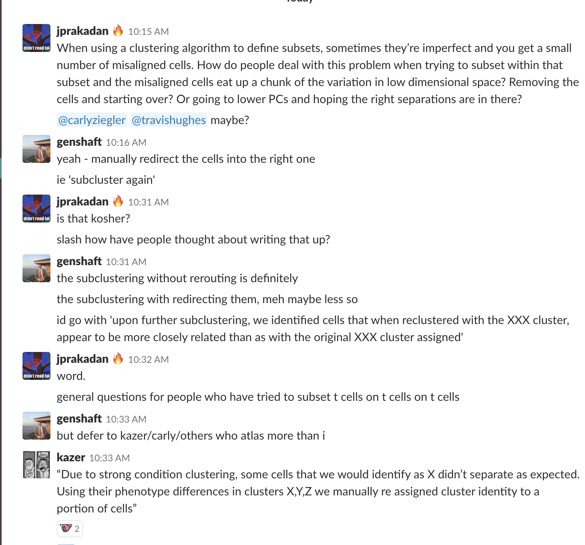

# Clustering
Since scRNA-seq is about defining the heterogeneity of cells, it is logical to try to group similar cells together into clusters. These clusters help make the noisy data more interpretable by combining cells that are similar and allowing us to compare the average gene expression of the clusters. The expected outcome of clustering varies a lot by the type of cells you have. In a atlas or tissue level study, you will expect many very distinguishable cell types that will probably be resolved similarly with different clustering methods, but if you have cells that you expect to be very similar - like if they were sorted by the same marker - you will expect the clusters to be obvious.

Clustering in really high dimensional space is very difficult and there are many techniques for doing this. Many of those that are most successful involve grouping cells using kernel or neighborhood methods - if these terms don’t make sense, don’t worry, here are some references that will help.

Here is a blog post on clustering comparison: https://jef.works/blog/2018/06/28/single-cell-clustering-comparison/ 

Here is a paper comparing clustering: https://f1000research.com/articles/7-1141/v1

Seurat’s clustering method: Seurat clusters using a combination of Nearest Neighbors clustering with a shrinking algorithm to prune the clustering tree. See the methods in [Butler et al.](https://www.nature.com/articles/nbt.4096), Nature Biotech (2018). When one clusters in Seurat using the FindClusters() call, there are a few sensitive parameters:
* pc.use - Choose the number of PCs to run clustering over. Important to only choose PCs that describe relevant variation in the data. Use Jackstraw/Variance explained and the actual genes defining PCs to pick the number of PCs to use.
* k.param - How big are the smallest neighborhoods? Increasing this forces clusters to be larger and can lead to poor clustering of small cell subsets. Inversely, decreasing this can cause too many non-distinct clusters to arise. 30 is a good place to start (default), but should be shrunk if your data set is small (less than ~500 cells).
* resolution - Where should the tree be cut to determine number of clusters. This is the most sensitive parameter, and the one that should be run iteratively. Based on the diversity of my data, I will choose for this to be higher (more diverse) or lower (less diverse). A good way to understand how well this parameter is set is to run differential expression on the clusters formed and see if the clusters separate strongly. If they don’t have clear gene separation then you are either too high (too many clusters, ie no real differences between sub clusters) or too low (too few clusters, ie diverse cells are being merged together). Sam: I like resolutions between 0.3-1 for most applications.

There is quite a bit of debate on the distinction between ‘cell type’ and ‘cell state’. Often a well defined cell type could be seen as a major cluster in your data with some sub-clusters that may describe cell state.

Jose: I like to view cell types as developmentally fixed lineages (e.g. epithelial, endothelial, stromal, T, B, myeloid, neural) which would not change types unless there is some malignant process severe enough to make them jump lineage (e.g. EMT in cancer). A subset would be something like a CD4 or CD8 T cell, which is also developmentally regulated, and unlikely to reverse course and come back as another one, a state is a set of modules acting within those constraints. State modules could be shared across types (e.g. cytotoxic CD4 and CD8 cells exist). Modules can sometimes contribute to clustering (why NK cells and CD8s often cluster together). 

In general, once you have clustered your cells, you should check that if and how clusters are defined by batch, patient, male/female etc, like you do for PCA or other dimensionality reduction. Even if clusters are defined by some metadata metric (batch inclusive) it doesn’t necessarily mean your data is bad or that analyses aren’t possible. Biological variation can overlap with technical variation, and oftentimes will dwarf that variation.

Another thing to think about if you have many different cell types like in an atlas is to do some iterative clustering (as Carly has described) - Find the major clusters then further cluster these clusters. This is a good guide when you are looking for the same cell types across multiple individuals/animals and multiple time points.

This paper (10.1016/j.cell.2018.05.057) takes you through a step-by-step of how they did their clustering.

# How do I know I have a good clustering?

One way to be convinced by your clustering is if each cluster has distinct marker genes. If multiple clusters have the same marker genes, they might be the same type of cells (or they might not - also do differential expression between those individual clusters and see if you get interesting differences). Play with your tree-cutting or resolution of the clustering method being used.

To get a statistical confidence on your clusters, one thing you can do is train a classifier between clusters (like a random forest) and test it on held out data then compare the cluster assignments of those held out data to their unsupervised clustering assignments. This is what they do in  https://doi.org/10.1016/j.cell.2018.06.021 .

# What if I am looking for rare cell subsets?

**Iterative clustering** - if your rare subset is likely to be found as a subset of some larger group (ex. A basal cell might be a subset of epithelial cells) and you have a large diversity of cell types, you can try subsetting your cells on this cluster that might contain the rare cells and re-clustering on just these cells. What is particularly important here is that before re-clustering you select variable genes and PCs again (as in re-run PCA on a new list of variable genes) on this cluster of cells. The variable genes and significant PCs on the whole dataset will likely be different that the ones that describe the heterogeneity of the cluster you are looking at, and if they were not sufficient to resolve your rare cell subsets in the first clustering, they probably won’t be enough in this clustering. This is because information contained PC that explains 1% of the variance in the whole data set might explain 10% of the variance in the subset.

Some packages for this (I have never tested these)

IterClust: https://bioconductor.org/packages/release/bioc/html/iterClust.html 

SciCast: https://github.com/iandriver/SCICAST 

One marker gene likely will not give you high confidence in the presence or absence of your rare subset. This is because of technical dropout as well as the fact that marker genes are usually known at a protein level which does not necessarily mean they are expected to be expressed at a high level.

See the approach in RaceID from Van Oudenaarden & Clevers: https://github.com/dgrun/StemID

Also see approach FiRE: https://www.nature.com/articles/s41467-018-07234-6 

GiniClust: https://genomebiology.biomedcentral.com/articles/10.1186/s13059-016-1010-4 

# What if some cells are clearly placed in the wrong clusters?

