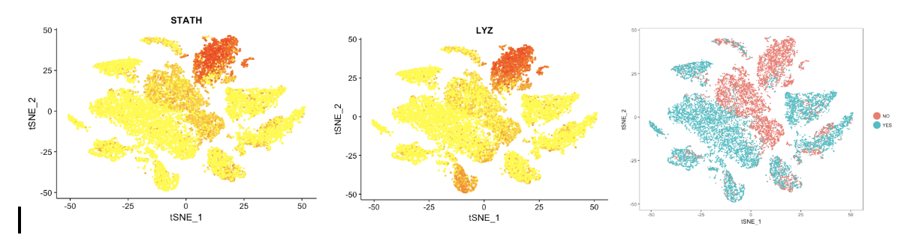
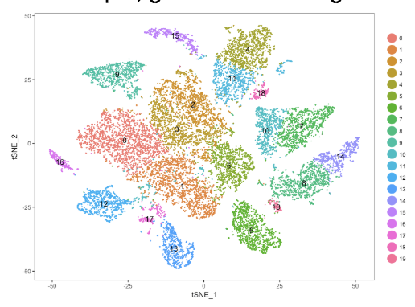
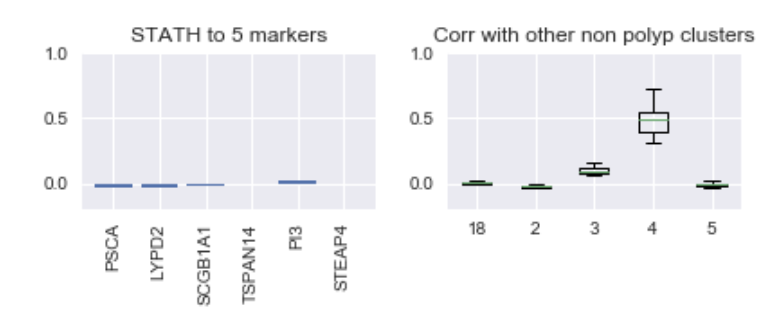

# Differential Expression
Once you have some clusters, you probably want to know what cells types these clusters represent! The way this is traditionally done is via differential expression analysis. The concept of comparing each gene independently between two conditions is common in microarray and bulk RNA-seq approaches, but we need some different modeling assumptions due to the technical noise of single cell RNA-seq as well as the larger number of ‘samples’ (cells) in the groups you are comparing.

### Some guiding principles:

* **Don’t trust a single gene:** Genes move in groups. It is very unlikely that one gene is acting alone, so if you see one gene that you know is a marker for T cells amongst a bunch of markers for epithelial cells, don’t assume it is a T cell cluster. Gene annotations are incomplete (so you could be seeing another function of this gene that has not been described), or there are technical reasons that seemingly random genes appear as marker genes for your clusters.
* **Always consider effect size:** When you have a lot of samples, a very small difference in magnitude can result in a tiny p-value. One of the most striking examples of this was a study that compared the IQs of older and younger siblings. They found that there was a highly significant difference in IQ between older and younger siblings in a large study, but the magnitude of this effect was less than an IQ point. If you have a lot of cells, you will have a lot of statistically significant differences - but the magnitude of these differences could be on the order of a portion of a UMI - so do we really care? Several people in the lab use Cohen’s d to calculate effect size effect size, which calculates the number of standard deviations between the mean of each of two groups. Cohen’s d, where effect size d = (Mean1-Mean2)/(SD pooled)
* **Clusters with the same ‘marker genes’ may or may not be the same cell type:** When you run the first-pass differential expression, you will usually be comparing each cluster to all other clusters in the data. Often, several genes will come up as differentially expressed for multiple clusters. This could be because these cells were ‘over clustered’ - split into too many clusters, or it could be because the cells are of similar types and the differences between the clusters with similar markers were of smaller magnitude than the differences between these clusters and the other clusters. To check this, run differential expression between just these clusters and consider the differentially expressed genes between these clusters too. (see note on spillover genes below though)

In general, people talk about the biggest issue in differential expression in single cell RNA-seq as the ‘zero-inflation’. Because of this, it is often modeled with zero-inflated distributions such as zero inflated negative binomial or zero inflated poisson. Some attempts have been made to include normalizing and library quality assumptions in the constructions of these models (including cell or gene specific scaling factors, etc). A comparative analysis of these techniques has been done recently: [Wang et al, 2019, BMC Bioinformatics](https://bmcbioinformatics.biomedcentral.com/articles/10.1186/s12859-019-2599-6). They say that there are large differences between the differential genes found in each method they test and that there is a trade off between false positives and missing true positives. They also say that methods built for single cell RNA-seq are not much better than those built for bulk data.

The Satija lab website has a nice vignette on differential expression methods available in Seurat:  https://satijalab.org/seurat/de_vignette.html 

The method in scanpy for differential expression is called ‘rankGeneGroups’ https://scanpy.readthedocs.io/en/latest/api/scanpy.api.tl.rank_genes_groups.html#scanpy.api.tl.rank_genes_groups and has some different methods from seurat. Notably, scanpy does not return a p-value of any sort for differential expression testing, it just gives a ‘score’ which is interpreted based on the method you use and is not well documented. Another important note about this method is that the default is to report genes that are both significantly up and significantly down in each cluster. You must change an input parameter to require that only one direction is returned. This can make gene set enrichment of markers confusing if you forget to check the direction of the change.

[SCDE](http://hms-dbmi.github.io/scde/) -Another scRNA-seq R package from the Karchenko lab which contains a bayesian approach to differential expression. Carly says it biases toward 0 vs one, not both on with magnitude differences - use likelihood ratio test or DESeq2 for magnitude differences.

Paper on bias, robustness, and scalability of differential expression: http://dx.doi.org/10.1101/143289 

Pops data: DESeq2 and EdgeR are the most commonly used differential expression methods
This tutorial: https://rpubs.com/ge600/deseq2 gives a good description of how to deal with differential expression when you have lots of conditions and want to do delta of deltas.

## Spillover genes 

Spillover genes are a specific kind of batch effect that we have a pretty good idea of the source of which actually helps with finding them! These genes come from cells that lyse before membrane sealing or from free RNA floating in the system. This means that basically all cell types in a sample will have expression for these genes. This becomes a problem when you are comparing between batches. For example, in Jose’s nasal polyp study, some marker genes for secretory cells were found distributed throughout the non-polyp samples but not in the polyp samples:

(pink is non polyp, blue is polyp, the top right cluster are non polyp cells high in this gene, but most other clusters dominated by non-polyp cells appear to have expression of these genes as well)
So when running differential expression between clusters that contain different proportions of polyp or non-polyp cells, these and other spillover genes come up as highly differentially expressed although they are not markers for that cell type. This can be misleading and frustrating for identifying cell types and understanding batch effects. Some observations about what these genes look like in the data are helpful for checking if they should be ignored from differential expression.
A spillover gene is highly expressed in most clusters of one batch or group but not in another.
A spillover gene often is correlated with marker genes of one cluster but not of the other clusters
For example, given the following clustering of the data:

We may want to see which genes are differentially expressed between clusters 1 and 5. Cluster 5 is mostly non-polyp cells while cluster 1 is mostly polyp cells. One of the genes that comes up as highly differentially expressed between these clusters is STATH. Because Jose knew this gene did not make sense, he was able to ignore it in figuring out his cell types, but if that is not as clear to you it is helpful to check if it is a spillover gene. If we look at the correlation of STATH with the genes found to be marker genes for cluster 5 when compared to all other clusters (as in not just cluster 1), we see that the correlation is low (apologies for the unlabeled axes, these were generated ages ago when I was really bad at plotting, the y axis of both plots is pearson correlation) The first plot shows the correlation of STATH to the top 5 marker genes of cluster 5 in cluster 5 cells, and the second plot shows the correlation of STATH to the top marker genes of the other clusters dominated by non-polyp cells in those clusters:

Since genes move in modules, a gene that is expressed outside of a module (as in not correlated with other genes of interest) in a given group of cells is most likely noise. 

This method of investigating these genes has not been fleshed out or turned into any type of statistically principled approach - it is just a series of observations, but hopefully awareness of what these genes look like is useful for looking at seemingly strange information in your data. 

When you realise something is a spillover gene, don’t remove it from the whole dataset as it could be descriptive for a specific cell type. What might make sense in this situation is for this gene to be removed from analysis of clusters where it is not correlated with the other marker genes - like cluster 5 - if analysis were to be done on this cluster independent of the secretory cell cluster where STATH is a marker.

MAGIC claims to handle these spillover genes- but haven’t tested 
SoupX is another method that has been described and Conner and Travis have been testing/using this method https://doi.org/10.1101/303727 
