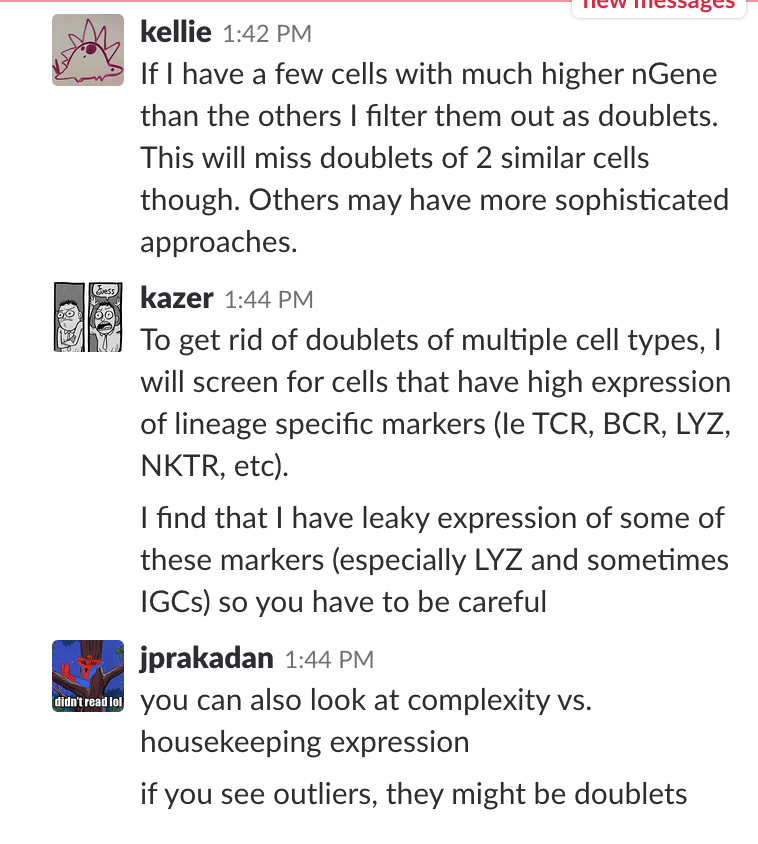

# Doublets

Sometimes in Seq-Well two cells end up in a single well or there could be incomplete dissociation in preparing the single cell suspension and therefore transcripts from two distinct cells have the same bead barcode. Unless you are Sam Allon and are specifically looking for this, you probably want to filter out these cells because they will confuse your analysis. If you are lucky, you will see a small cluster of cells with higher expression and conflicting signatures - for example BCR and TCR genes co-occuring in single cells. In that case it is pretty simple to filter them out.

A recent discussion (May 22, 2018) on the Regev Lab scRNA-seq analysis slack channel addressed issues regarding doublets. Ofir Cohen said that the best way to identify doublets of multiple cell types is to apply a pre-trained classifier to the data and consider ambiguously classified cells as doublets. There is a tool called ‘DoubletDetection’ https://github.com/JonathanShor/DoubletDetection that seems to be good at this without a pre-trained classifier available. This method is memory intensive though, so if you have a lot of cells it might be hard to run. As of these notes, this method has not been published or put on bioarxiv, but keep a look out! In addition, Allon tried it on Seq-Well data containing obvious B cell : T cell doublets. DoubletDetection missed most of these obvious doublets and instead called an unrealistically high number of doublets in the rest of the data.

Another tool posted on BioRxiv in June 2018 from Zev Gardner’s lab is DoubletFinder - https://doi.org/10.1101/352484 

Scrublet (Allon Klein): https://www.biorxiv.org/content/early/2018/07/09/357368  - Sarah tried this, it was pretty easy to install and run (in python), not sure how to assess it's quality though. 

DoubletDecon: https://www.biorxiv.org/content/early/2018/07/08/364810 

DoubletFinder (Zev Gardner): https://www.biorxiv.org/content/early/2018/06/26/352484 

