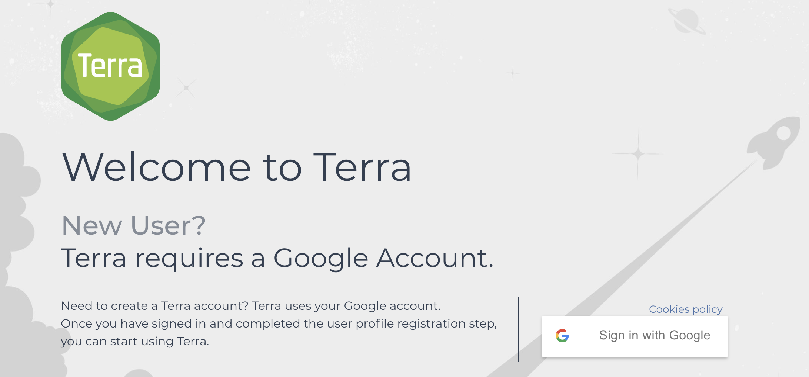
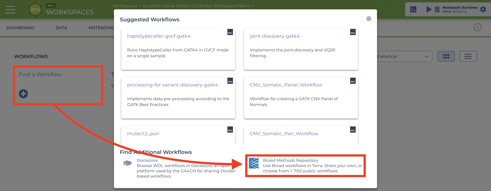
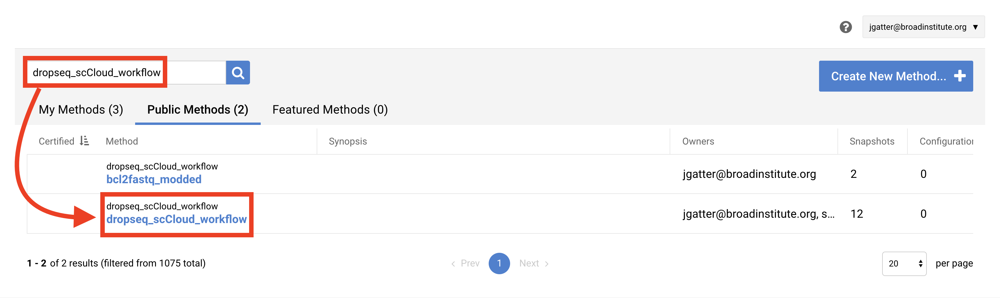
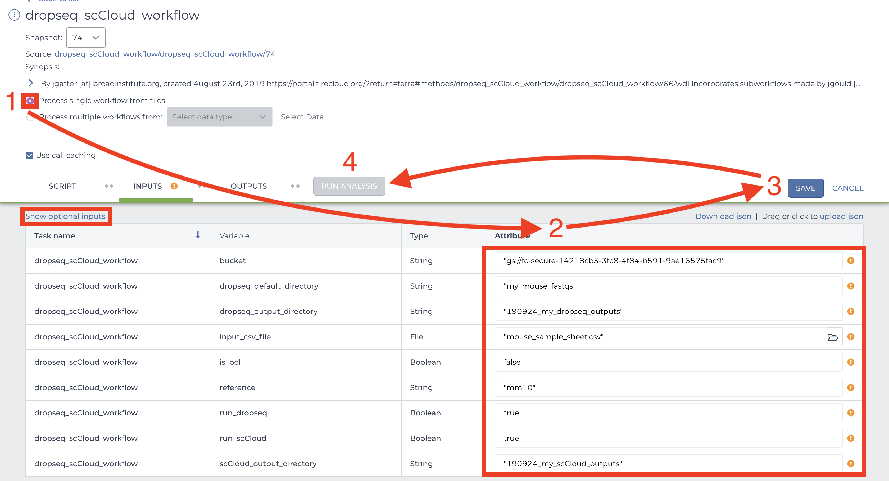

# How to for new Terra Users
This page is very WIP at this stage in time! Please give me feedback regarding anything that is unclear/could be expanded on!
  
## What is Terra:
Terra is the Broad Institute's bioinformatics/biomedical research cloud-computing platform that is built upon Google Cloud Platform. Unlike the Broad server on which we've run jobs in the past (and continue to until it ceases to exist), Terra has the advantage of leveraging Google's powerful network of remote servers to more quickly complete computationally intensive tasks. This of course, bears the unfortunate disadvantage of costing us sweet, sweet grant money. That being said, the benefits of Terra mostly outweigh the benefits of using the Broad server.

## What are things I can do on Terra?

In short, you can store your data on a Terra workspace bucket and either run Jupyter notebooks or workflows (WDL scripts) to process/analyze your data. I'm not covering Jupyter notebooks in this guide because I don't have enough experience running them on Terra.

For workflows, here are some common workflows we use in the lab:
* [dropseq_workflow](https://portal.firecloud.org/#methods/cumulus/dropseq_workflow/) for aligning Seq-Well data. If you have BCL directories which you wish to convert to fastq.gz for alignment you can also do this in dropseq_workflow by setting run_bcl2fastq=`true` Know that your tab-delimited sample sheet (.tsv) will instead need to be a single column containing gsURLs to the root of each BCL directory.
* You can also run a [bcl2fastq](https://portal.firecloud.org/#methods/cumulus/bcl2fastq/) workflow independently of dropseq_workflow but I recommend using dropseq_workflow with run_bcl2fastq=`true`, especially if you have more than one BCL directory.
* [cellranger_workflow](https://portal.firecloud.org/#methods/cumulus/cellranger_workflow/) for aligning 10x data.
* cumulus for quickly clustering and visualizing 10x or Seq-Well data.
* [smartseq2](https://portal.firecloud.org/#methods/cumulus/smartseq2/) workflow for aligning Smart-Seq2 sequence data.
* Searching for 'cumulus' in the Broad methods repository will show several tools of interest located in the Cumulus namespace.

If you don't see what you like follow [the instructions below](how_to_for_new_terra_users.html#4-import-a-workflow) and search for a workflow you might have in mind. If you don't find it you can create your own workflow (not covering how to do that right now so contact me).

## Basics of Running a Workflow

### 1. Sign In
Visit the [Terra by the Broad Institute](https://app.terra.bio/) and sign in using your preferred Google email account and complete the user profile registration steps if it is your first time using Terra.

### 2. Create a New Workspace. 

Before we start, I should say that in the lab we're aiming to have a one project-one workspace policy. If you're intending to publish a paper, use one bucket to store and process all data for that paper. Things get ridiculously cluttered when everyone is in one workspace and it becomes very hard to clean up after yourself and that racks up some $$$$.

After logging in/registration you will be brought to the "Your Workspaces" page, where you will see the "Create a New Workspace button. Click it and fill out the fields to your liking. 
  
You should use our shalek-lab-firecloud billing acount, or if you're just playing around, you can take advantage of Google's free $300 credit offer.
  
### 3. Add Your Sequence Data and Input CSV File
  
There are three methods of uploading files to your workspace Google Bucket. Before proceeding, find your workspace bucket by visiting your workspace's "Dashboard" tab. In the bottom-right corner of the dashboard, you will see your Google Bucket ID which you can copy by clicking the adjacent clipboard button. You can visit the bucket interface by clicking the "Open in Browser" hyperlink.
 
First upload your sequence data files using one of the methods below.
  
1. `gsutil` **HIGHLY RECOMMENDED**: Through your computer's console, install the `gsutil` tool by following the [installation guide](https://cloud.google.com/storage/docs/gsutil_install). An example command that would transfer files from your computer to the workspace bucket would be:  
`gsutil -m cp local/path/to/file.fastq.gz gs://[Bucket ID]/destination/directory/`  
For an entire folder of sequence data, copy it recursively through using the command as such:  
`gsutil -m cp -r local/path/to/folder gs://[Bucket ID]/destination/directory`.  
  
2. You can also manually upload data to the Google Bucket, but note that this process take much more time than `gsutil`. At the bottom right of your workspace's "Dashboard" tab, click the "Open in Browser" hyperlink to visit your bucket. Click either the "Upload File" or "Upload Folder" button to navigate to and upload your files or a folder containing your files respectively. 
  
3. Alternatively to `gsutil` and Google Bucket file uploading, users can manually upload data one file at a time through the Terra interface. This method is painfully slow so you should strongly consider using `gsutil`. Go to the "Data" tab and click the plus button towards the bottom-right of the page. Navigate to and select your file and hit open. Repeat the process for however many files. 
  
Before uploading an input CSV file for something like dropseq_workflow, it is recommended that you make certain that it adheres to the criteria specified in its documentation. To verify that the paths you listed in the file are correct, navigate to your bucket using the instructions listed above and locate your sequence data files. Click on each file to view its URI (gsURL), which should resemble the format `gs://<bucket ID>/path/to/file.fastq.gz` That whole string is what you will need to paste into your file. When finished, upload your input CSV file to the bucket.

### 4. Import a Workflow

This section may be subject to change in the recent future as Terra is still undergoing development and soon Firecloud Methods will be integrated to Terra rather than remain in the legacy application.

To import workflows for running jobs in your workspace, click the "Workflow" tab and click the "Find a Workflow" button. On the window that pops up, click the "Broad Method Repository" hyperlink to be brought to FireCloud Methods. .
  
In the search bar, enter the name of the tool you want (ex: "dropseq_scCloud_workflow"), hit search, and click on the workflow hyperlink when it appears. .
  
Towards the top-right of the workflow page, click "Export to Workspace..." button and then click the "Use Blank Configuration" button. I don't recommend giving the tool a custon name, that can get confusing for others working in your bucket. Select your workspace as the destination workspace via the bottom-most dropdown menu. Click the "Export to Workspace" button and when it offers you to visit the edit page, click "Yes". 

### 5. Configure and Launch a Workflow

You should be on the edit page of the tool now, this page is where you set variables for the workflow. To access this page of the tool in the future, you can go to the Workflow tab of your Terra Workspace and click on the workflow button.
  
Depending on the tool you may want "Process single workflow from files" or "Process multiple workflows from _____". It depends how the script works so check the author's documentation which can be found in the SCRIPT tab or via the tool's wiki (generally on readthedocs.org). If it is the latter option, you will need to find out how to upload data to the Data Tab of your workspace (I will get around to writing this part up in the future). 
  
Scroll down to fill out required inputs. Note that Strings must be surrounded by quotation marks and typing `true` and `false` (don't surround with quotation marks) for Booleans are case-sensitive. 
  
To set values for optional parameters, click the "Show optional inputs" text above the "Task name" column and scroll down. These are variables that have default values if the boxes are left empty, so there is no need to fill each out unless it suits your needs. To better understand the inputs, read the tool documentation.
  
When satisfied with your inputs, save them using the button in the upper-right and and then hit the "RUN ANALYSIS" button to the left. You will be brought to the job history page where your job has been logged. Here you will eventually know if the job ran successfully. It probably won't.

**While your workflow is running:** During the run, you can check on your workflow under the 'Job History' tab in your workspace. From there you can click on your workflow that is running, then click 'View' to see the progress. This will let you see any steps in the workflow that are completed, but be aware that the 'timing diagram' tab does not update until each subprocess is done running so don't be confused if you don't see the process it says it is running under that tab.

### 6. Advice for Troubleshooting

If the job fails it is recommended you navigate to and read the log file of the task that failed.  
To do this, click the failed job in "Job History" tab and click "View" on the next page. Then on the workflow status page under the "List View" tab, click the hyperlink of the failed task and repeat if there are failed subtasks. On the failed subtask that has no children, click on the backend log file button and skim to gain a better understanding. 
  
Evaluate the error based on the message and decide whether you need to alter variables, move files in your bucket, or change and reupload your input CSV file if you used one. You can also ~~give up~~ ask for help on the Slack #computational channel!

Note that some pipelines (like the dropseq pipeline for instance) will resume from where they failed if intermediate files were created and the output directory you specify as input is the same as the previous run.

### 7. Clean Up

After running a job in your bucket you will see a directory (bucket object) appear with a randomly generated name. This is a Cromwell execution directory, which contains workflow files including the task log files that are useful for reviewing how your job performed. Once in a while it's good to delete these execution directories because they take up space, and space isn't cheap. If you're interested in keeping the log files, they barely take up space so you can copy them out and rename them something more descriptive using `gsutil -m mv gs://bucketID/path/to/logfile.log gs://bucketID/job/newfilename.log`. For giving new names try something like `YYMMDD_JobID_taskname.log`. It's equally important to transfer out processed data and other outputs to your local machine or another Google Bucket. To do this, also use the `gsutil -m mv` command.
