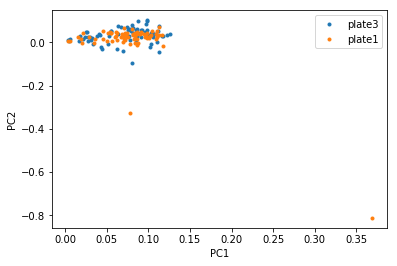

# PCA
Note: people usually run PCA on the log-normalized data, and only on highly variable genes.

Also note: we are not about to explain PCA right here, there are links to descriptions of PCA where people do a way better job than I could at teaching it

The reason we use PCA with scRNA seq data comes from the idea that genes move in modules, so gene expression space is not really 20,000-dimensional like the raw gene expression matrices would have you believe- it actually exists on a much lower dimensional space. Since genes move together in ‘modules’ the idea is that each principal component represents one gene module. It is not always that straightforward (partially because PCA is not sparse - it gives a weighting to each gene for each principal component -try sparse PCA or ICA (independent component analysis), but also because the data is super noisey and zero inflated - you didn’t think it could be that easy, right?)

PCA explained - [STATQUEST!](https://www.google.com/url?q=https://youtu.be/_UVHneBUBW0&sa=D&ust=1539979813152000)

One of the first questions Alex will ask you about your data is what the PC’s are. He doesn’t necessarily want you to just show him a plot of PC1 vs PC2 (though that could be informative), but he is asking if you have determined the source of most of the variation in your data.

PCA, in general, is a method to identify orthogonal directions of variation in your data. The principal components are returned in a ranked order by the amount of variation they represent. You can use these components to visualize your cells in a lower dimensional space- each cell will have a value for each PC, so you can visualize your cells in a two dimensional plot where the coordinate of each cell is its value for PC1 on the x-axis and its value for PC2 on the y-axis. You can do this for any combinations of PC’s.

When I run PCA, the first think I do is look at the first few PC’s plotted against each other.

One thing I am looking for is cells that are clearly outliers:

A plot like this would make me consider updating my filtering to remove those two orange cells that are huge outliers in PC2.  (Note that this plot is actually PCA on non-normalized data and that is probably why it looks so bad, but I had it on hand so let’s just go with it)

The next thing I am looking for is to see if any metadata I have can explain the visual separation in any of the PC’s. Specifically I look for changes in technical metadata like %transcript mapping, number of genes, number of transcripts etc. These are things that I used to filter my cells, and good mixing in the PCs of these metadata indicate to me that my filtering was adequate. If there is separation based on these metadata it does not necessarily mean that the filtering is bad, these could be batch effects and one option is to regress them out (see batch correction section). I visualize these effects by simply coloring my PCA plots on this metadata.

Next I look for separation based on categorical metadata like the plate/array the data originated from, the sequencing run, patient, disease condition, tissue of origin, or any other information I have. For technical metadata, like plate/array or sequencing run I usually look for the data to be well-mixed, but often these metadata match up with experimental conditions (like all the healthy patients were run on the same sequencing run), so don’t fret immediately if these look like batch effects on first glance.

Another thing to look for is %variance explained in each PC here. It can help understand whether PCs are important. PCs are ranked based on their %variance explained and usually almost all of the variance is explained by the first few PCs.

Formally, the best way to know which PC characterizes which type of metadata is, for each PC, to correlate the PC loading for each cell with the metadata value for that cell. This is more efficient than visual inspection and probably more of what Alex is looking for.

Next he will want you to tell him which genes correspond to each PC. Sometimes a PC will be largely dominated by cell cycle genes or housekeeping genes or cell death genes. This is not metadata we have in our metadata matrix, but it is not hard to find out. If you have lists of genes that correspond to some process you are interested in, you can create a score based on those genes for each cell, treat that as metadata, and correlate that with the PC loadings as above. Alternatively, you can figure out which genes have the highest loadings in each PC. Seurat will do this for you, but if you want to do it on your own, you can either run PCA on the transpose of your matrix - this will give you the gene loadings. Or you can do this manually by taking the dot product of your expression matrix with the cell loadings. Then you can take the genes with the highest absolute loadings (so highly positive or highly negative) and see if they indicate some biological process you are familiar with.

After running PCA and looking at your PC’s, you’re probably going to want to do some more dimensionality reduction to get a better (read: prettier) look at the data. Usually downstream dimensionality reduction is run on the PC’s, so you need to choose how many PC’s are useful. The way I do this is to simply look at the percent variance explained by each PC and try to include most of the variance in the downstream analysis. I know there are more complex and likely more valid ways to do this, so please correct me! (The Seurat tutorial mentions some of them). The ideas behind including more PC’s/fewer PC’s are along the same lines of choosing how many variable genes to include - the more you include the more variance you will capture, but it will be harder to differentiate this variance from noise. This is also an iterative process! Re-run PCA if you subset your cells (and also re-select variable genes before re-running PCA).

